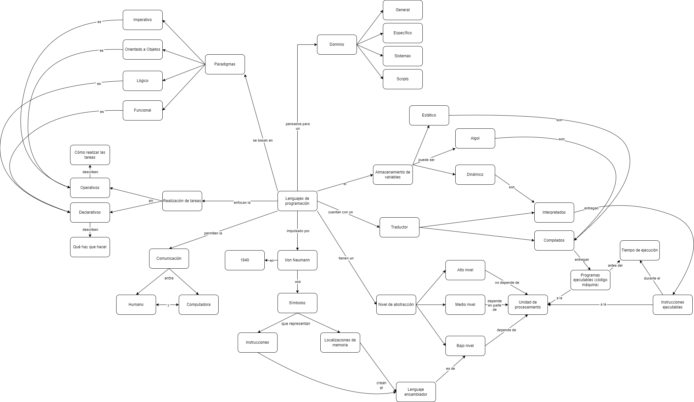
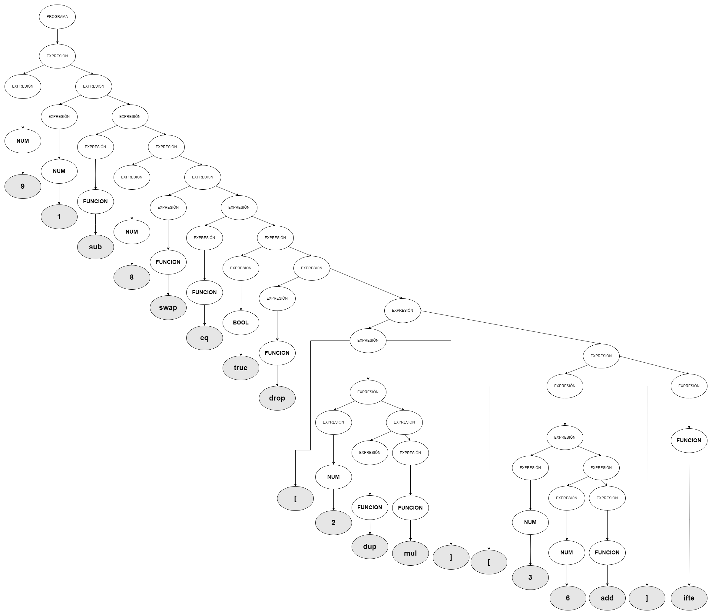
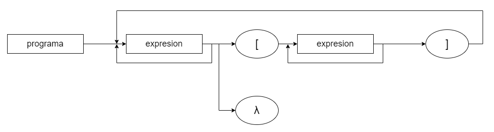
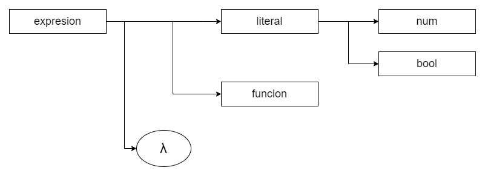
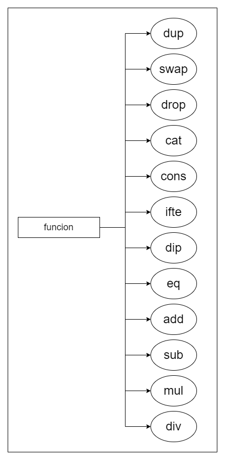
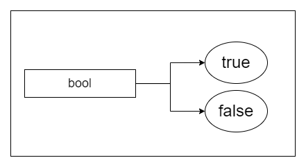
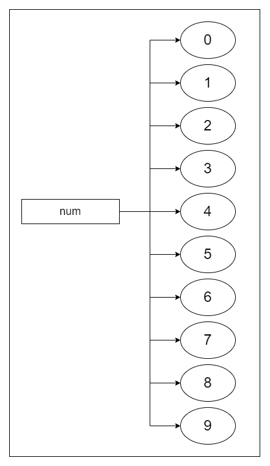

# TPs de Características de Lenguajes de Programación
## Di Salvo, Tobías

## TP 1
Empezaremos con un mapa conceptual sobre los lenguajes de programación y sus características. Esta es mi propuesta:

## TP 2
Para el segundo TP realizaremos una clasificación de lenguajes en base a sus características. Pueden verse en el siguiente enlace:
[Enlace a la tabla](https://docs.google.com/spreadsheets/d/19aTSzIjQNs6RBNJFz0bftTlqKr-uWbohbBZnxmP0-r0/edit?usp=sharing)

## TP 3
El lenguaje elegido para el TP3 es CAT, un lenguaje esotérico que basa su ejecución en una pila. Las instrucciones se apilan en una estructura y se van ejecutándo secuencialmente sobre el elemento que está en el tope. Esta gramática es del lenguaje puro, con sus instrucciones primitivas únicamente.

#### GIC
~~~
S -> L | F | SS | [S]
L -> N | B
N -> 0 | 1 | 2 | 3 | 4 | 5 | 6 | 7 | 8 | 9
B -> true | false
F -> dup | swap | drop | cat | cons | ifte | dip | eq | add | sub | mul | div
~~~
#### BNF
~~~
<expresion> ::= <literal> | <funcion> | <expresión> <expresion> | [ <expresion> ]

<literal> ::= <num> | <bool>

<num> ::= 0 | 1 | 2 | 3 | 4 | 5 | 6 | 7 | 8 | 9

<bool> ::= true | false

<función> ::= dup | swap | drop | cat | cons | ifte | dip | eq | add | sub | mul | div
~~~
#### EBNF
~~~
programa = { expresion }* ;
expresion = literal | funcion | "[" expresion "]" ;

literal    = num | bool ;

num        = "0" | "1" | "2" | "3" | "4" | "5" | "6" | "7" | "8" | "9" ;

bool       = "true" | "false" ;

funcion    = "dup" | "swap" | "drop" | "cat" | "cons" | "ifte" | "dip" |
             "eq" | "add" | "sub" | "mul" | "div" ;

~~~
#### ABNF
~~~
expresion:  literal
            funcion
            [expresion]
            λ

literal: uno de  num bool

num: uno de  0 1 2 3 4 5 6 7 8 9

bool: uno de  true false

funcion: uno de  dup swap drop cat cons ifte dip eq add sub mul div
~~~

## TP 4
Para el cuarto trabajo desarrollaremos el **Árbol semántico** y el **Diagrama de Conway** sobre la gramática planteada en el anterior ejercicio. El primero nos indica cómo podemos utilizar la gramática para llegar a las expresiones de nuestro lenguaje. Por otra parte, el segundo nos muestra el flujo que tiene nuestra gramática planteada.

#### Árbol semántico
Veremos un ejemplo de un árbol semántico para la siguiente expresión:
~~~
9 1 sub 8 swap eq true drop [ 2 dup mul ] [ 3 6 add ] ifte
~~~
En ella pasamos por varias funciones, números, un booleano y citas (los bloques de código delimitados por "[]"). Entonces:

#### Diagrama de: Programa

#### Diagrama de: Expresión

#### Diagrama de: Función

#### Diagrama de: Booleano

#### Diagrama de: Número
